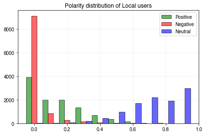
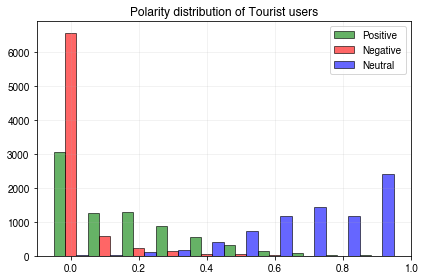
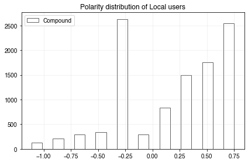
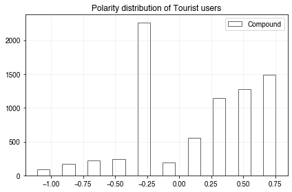
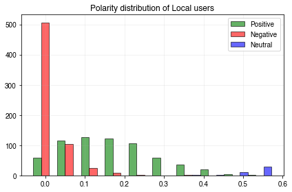
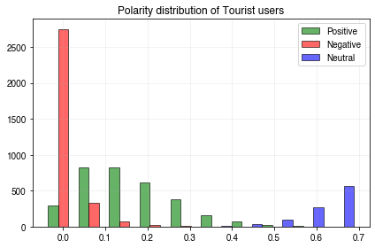

```python
import psycopg2 as db
import pandas as pd
import geopandas as gpd
from dotenv import dotenv_values
from senti_preprocess.senti_preprocess.twitter import remove_urls, remove_mentions, segment_hashtags
```


```python
conn_twitter = db.connect(**dotenv_values())
```

# Sentiment analysis on Twitter and TripAdvisor

In this notebook, a sentiment analysis on a one month sample of POI tweets and TripAdvisor reviews located in London is performed. The [Valence Aware Dictionary and sEntiment Reasoner](https://github.com/cjhutto/vaderSentiment) will be used, which is a lexicon and rule based sentiment analyzer and was sepcifically developed for analyzing social media text data. First up: Twitter. 

## Twitter

### 1. Load data


```python
tweet_sample_query = """
SELECT
    sq.id, sq.text, sq.place_full_name, sq.place_geom, sq.location_within_london
FROM
    (
        SELECT
            *
        FROM
            tweets_sample
        JOIN
            user_classification as uc
        ON
            tweets_sample.user_id = uc.user_id
    ) as sq, greater_london
WHERE
    sq.place_type = 'poi'
AND
    sq.lang = 'en'
AND ST_WITHIN(sq.place_geom, greater_london.geometry)
"""
```


```python
df = pd.read_sql(tweet_sample_query, conn_twitter)
```

### 2. Preprocess tweets

Three preprocessing steps are performed on each tweet:
   1. ```
   remove_urls()
   ``` removes any urls from the tweet by matching ```r"http\S+"``` and replacing any matches with a space.
   2. ```
   remove_mentions()
   ```removes any mentions from the tweet by matching ```r"@[A-Za-z0-9]+"``` and replacing any matches with a space.
   3. ```
   segment_hashtags()
   ``` finds all the hashtags in a tweet, and looks for those that contain medial capitals (also informally known as camel casing or camelCasing). These are separated into the single words, and the tweet with now segmented hashtags is returned.


```python
def clean_tweet(tweet_string):
    tweet_string = remove_urls(tweet_string)
    tweet_string = remove_mentions(tweet_string)
    tweet_string = segment_hashtags(tweet_string)
    return tweet_string
```


```python
df["cleaned_tweet"] = df["text"].apply(clean_tweet)
```


```python
# Sample exploration
for i in range(20):
    print("{:-^50}".format(i))
    for column, descr in zip(["text", "cleaned_tweet"], ["UNCLEANED", "CLEANED"]):
        print(f'{descr}:\n {df.iloc[i][column]}')
    
```

    ------------------------0-------------------------
    UNCLEANED:
     Merry Christmas from me and my lychee martini 🎄❤️ https://t.co/HbdX8SnBZc
    CLEANED:
     Merry Christmas from me and my lychee martini 🎄❤️  
    ------------------------1-------------------------
    UNCLEANED:
     @missionswl #Emmanuel #God in #Christ #Jesus
    is with us #ChristmasDay #yesterday #TOMORROWFOREVER #CMCWorship #AllareWelcome
    Chelsea Fulham Methodist Church
    Revd Mark Davenport minister https://t.co/RONFPHmgM7
    CLEANED:
        Emmanuel  God in  Christ  Jesus
    is with us   Christmas Day yesterday TOMORROWFOREVER CMC Worship  Allare Welcome
    Chelsea Fulham Methodist Church
    Revd Mark Davenport minister  
    ------------------------2-------------------------
    UNCLEANED:
     Ever wondered what Jeremy @theJeremyVine does on Christmas Day? Well, now you know...
    #ChristmasDay #cycling #Battersea https://t.co/wtqZkybOAF
    CLEANED:
     Ever wondered what Jeremy   does on Christmas Day? Well, now you know...
     Christmas Day cycling  Battersea  
    ------------------------3-------------------------
    UNCLEANED:
     A whopping 2545 runners this morning at @bushyparkrun, WOW! What a beautiful day it was and a fab way to start off Christmas. #loveparkrun https://t.co/mi0Nf2O2wi
    CLEANED:
     A whopping 2545 runners this morning at  , WOW! What a beautiful day it was and a fab way to start off Christmas. loveparkrun  
    ------------------------4-------------------------
    UNCLEANED:
     Art pic; Colours; Red.  Ladybug /Ladybird, Warren farm August 2019.  By @Neil_HW_
    
    Staying mainly dry, possibly for a few days with a peppering of rain here and there.
    
    #StormHour #ThePhotoHour
    #ProtectWarrenFarm
    #naturefirst https://t.co/OLb5ZTbsGI
    CLEANED:
     Art pic; Colours; Red.  Ladybug /Ladybird, Warren farm August 2019.  By  _HW_
    
    Staying mainly dry, possibly for a few days with a peppering of rain here and there.
    
     Storm Hour  The Photo Hour
     Protect Warren Farm
    naturefirst  
    ------------------------5-------------------------
    UNCLEANED:
     @hammersmithandy the holidays are over. Get back to work and fix our roads properly. Months and millions wasted by ineffective local labour? Seriously, who signed this off? Disgusting this is what you do to our local streets. Would you accept this if you lived on this street? https://t.co/VwmaaYH0qM
    CLEANED:
       the holidays are over. Get back to work and fix our roads properly. Months and millions wasted by ineffective local labour? Seriously, who signed this off? Disgusting this is what you do to our local streets. Would you accept this if you lived on this street?  
    ------------------------6-------------------------
    UNCLEANED:
     Only bit of travelling I need to do this Christmas &amp; as I walk into station (at a breathless pace with 3mins to spare) I hear the train is cancelled. Next one in an hour. I cant be bothered to walk back home  (I'll prob be almost late again if I do) so sat watching world go by
    CLEANED:
     Only bit of travelling I need to do this Christmas &amp; as I walk into station (at a breathless pace with 3mins to spare) I hear the train is cancelled. Next one in an hour. I cant be bothered to walk back home  (I'll prob be almost late again if I do) so sat watching world go by
    ------------------------7-------------------------
    UNCLEANED:
     Seems the appropriate place to start the 50th birthday #theSmiths https://t.co/5mBZmNbpSU
    CLEANED:
     Seems the appropriate place to start the 50th birthday the Smiths  
    ------------------------8-------------------------
    UNCLEANED:
     Triple-parked on my 30th. Time for Las Vegas with @JessamineKate 🥳 https://t.co/CY974CDQVA
    CLEANED:
     Triple-parked on my 30th. Time for Las Vegas with   🥳  
    ------------------------9-------------------------
    UNCLEANED:
     @RedbrickedSlums very lovely,  soothing, and hopeful,  thankyou
    CLEANED:
       very lovely,  soothing, and hopeful,  thankyou
    ------------------------10------------------------
    UNCLEANED:
     The Tricycle by Fernando Arrabal
    
    Strangely light-hearted tale of poverty and murder starts this January 2020 in Barons Court Theate in London
    
    Follow us on https://t.co/4ZoSurj90E or https://t.co/ZPtRQsJu7A for more information!
    
    #theatre #london https://t.co/xfnvmHsoca
    CLEANED:
     The Tricycle by Fernando Arrabal
    
    Strangely light-hearted tale of poverty and murder starts this January 2020 in Barons Court Theate in London
    
    Follow us on   or   for more information!
    
    theatre london  
    ------------------------11------------------------
    UNCLEANED:
     @atptour @Cristiano @DjokerNole 2 legends ⚽️🥎💪💪
    CLEANED:
           2 legends ⚽️🥎💪💪
    ------------------------12------------------------
    UNCLEANED:
     @imaginecurve I have used the wrong card to make a transaction and cant go back in time as its over £1k. Have emailed Curve Supprpt 24hrs ago but no response. Need advice ASAP as it's an important payment
    CLEANED:
       I have used the wrong card to make a transaction and cant go back in time as its over £1k. Have emailed Curve Supprpt 24hrs ago but no response. Need advice ASAP as it's an important payment
    ------------------------13------------------------
    UNCLEANED:
     Sunnying shortly! https://t.co/P8OBmu9ZPB
    CLEANED:
     Sunnying shortly!  
    ------------------------14------------------------
    UNCLEANED:
     If I was looking for a word to describe the Gents toilets at the Victoria and Albert museum, that word would be pink. 
    #FridayThoughts #Kensington #toilets https://t.co/eHzKAHB5Sk
    CLEANED:
     If I was looking for a word to describe the Gents toilets at the Victoria and Albert museum, that word would be pink. 
     Friday Thoughts  Kensington toilets  
    ------------------------15------------------------
    UNCLEANED:
     The weather is soo cold😿💗 https://t.co/yHW8rdop7V
    CLEANED:
     The weather is soo cold😿💗  
    ------------------------16------------------------
    UNCLEANED:
     @joepike @BorisJohnson @itvcalendar How dare you @joepike try and make @BorisJohnson engage with the people of this country and for him to go off script 😒 he doesn’t want to engage, it’s better to keep the leavers on side by saying the same nonsense. #VoteNotTory
    CLEANED:
           How dare you   try and make   engage with the people of this country and for him to go off script 😒 he doesn’t want to engage, it’s better to keep the leavers on side by saying the same nonsense.  Vote Not Tory
    ------------------------17------------------------
    UNCLEANED:
     📣 The start of the #NATOEngages conference, the official event accompanying the #NATO Leaders Meeting in London. 
    
    Heads of state and experts gathered at Westminster to discuss the future of the Alliance. 
    
    Main topics: #Innovating the Alliance and #CyberSecurity 💻 https://t.co/wXPqU00zmA
    CLEANED:
     📣 The start of the NATO Engages conference, the official event accompanying the NATO Leaders Meeting in London. 
    
    Heads of state and experts gathered at Westminster to discuss the future of the Alliance. 
    
    Main topics:  Innovating the Alliance and  Cyber Security 💻  
    ------------------------18------------------------
    UNCLEANED:
     Great ideas being discussed at this morning's @TechDataASUK Healthcare ecosystem #designthinkingworkshop. Partners and IBMers focused on Healthcare clients looking at how to create best of breed solutions. https://t.co/oyMoxkYQYf
    CLEANED:
     Great ideas being discussed at this morning's   Healthcare ecosystem designthinkingworkshop. Partners and IBMers focused on Healthcare clients looking at how to create best of breed solutions.  
    ------------------------19------------------------
    UNCLEANED:
     1pm. Improving crowd resilience :) https://t.co/epnCu6IyVB
    CLEANED:
     1pm. Improving crowd resilience :)  


The cleaned tweets look good, and the hashtag segmentation seems to work as expected. So let's feed the data into the analyzer

### 3. Sentiment analysis


```python
import vaderSentiment.vaderSentiment as vader
```


```python
senti_analyzer = vader.SentimentIntensityAnalyzer()
```


```python
def calculate_sentiment(series):
    tweet = series["cleaned_tweet"]
    sentiment = senti_analyzer.polarity_scores(tweet)
    for key in sentiment.keys():
        series[key] = sentiment[key]
    return series
```


```python
df = df.apply(calculate_sentiment, axis=1)
```


```python
df
```


<div>
<style scoped>
    .dataframe tbody tr th:only-of-type {
        vertical-align: middle;
    }

    .dataframe tbody tr th {
        vertical-align: top;
    }

    .dataframe thead th {
        text-align: right;
    }
</style>
<table border="1" class="dataframe">
  <thead>
    <tr style="text-align: right;">
      <th></th>
      <th>id</th>
      <th>text</th>
      <th>place_full_name</th>
      <th>place_geom</th>
      <th>location_within_london</th>
      <th>cleaned_tweet</th>
      <th>neg</th>
      <th>neu</th>
      <th>pos</th>
      <th>compound</th>
    </tr>
  </thead>
  <tbody>
    <tr>
      <th>0</th>
      <td>1209819446329724929</td>
      <td>Merry Christmas from me and my lychee martini ...</td>
      <td>Mandarin Oriental Hyde Park</td>
      <td>0101000020E610000094A5D6FB8D76C4BFF8544E7B4AC0...</td>
      <td>unclassified</td>
      <td>Merry Christmas from me and my lychee martini ...</td>
      <td>0.0</td>
      <td>0.759</td>
      <td>0.241</td>
      <td>0.5423</td>
    </tr>
    <tr>
      <th>1</th>
      <td>1209819577770762240</td>
      <td>@missionswl #Emmanuel #God in #Christ #Jesus\n...</td>
      <td>Chelsea Methodist Church</td>
      <td>0101000020E6100000DA1EBDE13E72C5BF30DAE38574BE...</td>
      <td>local</td>
      <td>Emmanuel  God in  Christ  Jesus\nis with us...</td>
      <td>0.0</td>
      <td>0.742</td>
      <td>0.258</td>
      <td>0.7430</td>
    </tr>
    <tr>
      <th>2</th>
      <td>1209820427528409089</td>
      <td>Ever wondered what Jeremy @theJeremyVine does ...</td>
      <td>Battersea Power Station</td>
      <td>0101000020E6100000978C63247B84C2BF3ECF9F36AABD...</td>
      <td>local</td>
      <td>Ever wondered what Jeremy   does on Christmas ...</td>
      <td>0.0</td>
      <td>0.877</td>
      <td>0.123</td>
      <td>0.2732</td>
    </tr>
    <tr>
      <th>3</th>
      <td>1209820766486900736</td>
      <td>A whopping 2545 runners this morning at @bushy...</td>
      <td>Bushy parkrun</td>
      <td>0101000020E6100000419DF2E84658D5BF3F1D8F19A8B4...</td>
      <td>unclassified</td>
      <td>A whopping 2545 runners this morning at  , WOW...</td>
      <td>0.0</td>
      <td>0.642</td>
      <td>0.358</td>
      <td>0.9140</td>
    </tr>
    <tr>
      <th>4</th>
      <td>1210515867903123456</td>
      <td>Art pic; Colours; Red.  Ladybug /Ladybird, War...</td>
      <td>Warren Farm</td>
      <td>0101000020E6100000AFD2DD7536E4D6BF0F0C207C28BF...</td>
      <td>unclassified</td>
      <td>Art pic; Colours; Red.  Ladybug /Ladybird, War...</td>
      <td>0.0</td>
      <td>0.933</td>
      <td>0.067</td>
      <td>0.3818</td>
    </tr>
    <tr>
      <th>...</th>
      <td>...</td>
      <td>...</td>
      <td>...</td>
      <td>...</td>
      <td>...</td>
      <td>...</td>
      <td>...</td>
      <td>...</td>
      <td>...</td>
      <td>...</td>
    </tr>
    <tr>
      <th>23428</th>
      <td>1209810083829428225</td>
      <td>Merry Christmas everyone 🍻 https://t.co/oNube4...</td>
      <td>The Archers</td>
      <td>0101000020E6100000C6FD47A643A7C93F88BB7A1519CB...</td>
      <td>tourist</td>
      <td>Merry Christmas everyone 🍻</td>
      <td>0.0</td>
      <td>0.588</td>
      <td>0.412</td>
      <td>0.5423</td>
    </tr>
    <tr>
      <th>23429</th>
      <td>1209811961879441413</td>
      <td>Happy and peaceful Christmas to all https://t....</td>
      <td>The Church of Our Most Holy Redeemer</td>
      <td>0101000020E6100000E2218C9FC6BDC5BF677E350708BE...</td>
      <td>tourist</td>
      <td>Happy and peaceful Christmas to all</td>
      <td>0.0</td>
      <td>0.367</td>
      <td>0.633</td>
      <td>0.7845</td>
    </tr>
    <tr>
      <th>23430</th>
      <td>1209815028796469248</td>
      <td>Merry Christmas from everyone here at @Burgean...</td>
      <td>Burge and Gunson</td>
      <td>0101000020E6100000B6D958897956C6BF5116BEBED6B5...</td>
      <td>unclassified</td>
      <td>Merry Christmas from everyone here at   🎄🎁 chr...</td>
      <td>0.0</td>
      <td>0.714</td>
      <td>0.286</td>
      <td>0.7506</td>
    </tr>
    <tr>
      <th>23431</th>
      <td>1209816483687215104</td>
      <td>MERRY CHRISTMAS EVERYONE!!</td>
      <td>Bellingham Film Palace</td>
      <td>0101000020E610000030D63730B95194BFA59F70766BB7...</td>
      <td>local</td>
      <td>MERRY CHRISTMAS EVERYONE!!</td>
      <td>0.0</td>
      <td>0.329</td>
      <td>0.671</td>
      <td>0.6229</td>
    </tr>
    <tr>
      <th>23432</th>
      <td>1209816483687215104</td>
      <td>MERRY CHRISTMAS EVERYONE!!</td>
      <td>Bellingham Film Palace</td>
      <td>0101000020E610000030D63730B95194BFA59F70766BB7...</td>
      <td>local</td>
      <td>MERRY CHRISTMAS EVERYONE!!</td>
      <td>0.0</td>
      <td>0.329</td>
      <td>0.671</td>
      <td>0.6229</td>
    </tr>
  </tbody>
</table>
<p>23433 rows × 10 columns</p>
</div>


The sentiment analysis worked, so a deeper look at the results would be appropriate.


```python
from matplotlib import pyplot as plt
import numpy as np
plt.rc('font', family='Helvetica')
```


```python
 def pol_plot(df, user_classification_column):
    user_groups = ["local", "tourist"]
    group_names = ["Local users", "Tourist users"]
    for group, group_name in zip(user_groups, group_names):
        dframe = df.loc[df[user_classification_column] == group]
        edgecolor = "black"
        alpha = 0.6
        fig, ax = plt.subplots()
        columns = ["pos", "neg", "neu"]
        colors = ["green", "red", "blue"]
        legend_dict = dict(zip(columns, colors))

        labels = ["Positive", "Negative", "Neutral"]
        handles = [plt.Rectangle((0,0),1,1, facecolor=legend_dict[column], alpha=alpha, edgecolor=edgecolor) for column in columns]

        for index, (col, color) in enumerate(zip(columns, colors)):
            if index == 0:
                hist_tuple_first = np.histogram(dframe[col])
                width = (hist_tuple_first[1][1] - hist_tuple_first[1][0])/(len(columns))
                print(width)
                ax.bar(hist_tuple_first[1][:-1] - width, hist_tuple_first[0], facecolor=color, alpha=alpha, width=width, edgecolor=edgecolor)
            else:
                hist_tuple = np.histogram(dframe[col], bins=hist_tuple_first[1])
                ax.bar(hist_tuple[1][:-1] + width * (index - 1), hist_tuple[0], facecolor=color, alpha=alpha, width=width, edgecolor=edgecolor)

        plt.legend(handles, labels)
        plt.grid(True, which="both", alpha=0.3, linewidth=0.5)
        plt.title(f"Polarity distribution of {group_name}")
        plt.tight_layout()
```


```python
pol_plot(df, "location_within_london")
```

    0.03333333333333333
    0.03333333333333333


    

    


    

    


```python
from IPython.display import Markdown
```


```python
def pretty_print_row(df, row_indices, color_dict, text_col):
    markdown = ""
    for i in row_indices:
        markdown = add_to_markdown(markdown, "{:-^75}".format(i))
        markdown = add_to_markdown(markdown, df.iloc[i][text_col])
        
        for key in color_dict.keys():
            markdown = add_to_markdown(markdown, df.iloc[i][key], color=color_dict[key])
    return markdown

def add_to_markdown(str_1, str_2, color="black"):
    str_1 = str(str_1)
    str_2 = str(str_2)
    
    if color=="black":
        return str_1 + str_2 + "<br>"
    else:
        return str_1 + "<p style=color:{}>".format(color) + str_2 + "</p>"
```


```python
def get_high_polarity_tweets(df, quantile=0.9, max_tweets=50):
    polarity_dict = {}
    for polarity in ["pos", "neg"]:
        quantile = df[polarity].quantile(quantile)
        polarity_dict[polarity] = df[polarity].sort_values(ascending=False).loc[df[polarity] > quantile].index[:max_tweets]
    return polarity_dict
```


```python
high_polarity_tweets = get_high_polarity_tweets(df=df, max_tweets=50)
markdown = pretty_print_row(df=df, row_indices=high_polarity_tweets["pos"], color_dict=legend_dict, text_col="text")
Markdown(markdown)
```


-----------------------------------15580-----------------------------------<br>@TheSun Classy<br><p style=color:green>1.0</p><p style=color:red>0.0</p><p style=color:blue>0.0</p>-----------------------------------12047-----------------------------------<br>@work1ngmensclub  cheered https://t.co/ou9i42k5cb<br><p style=color:green>1.0</p><p style=color:red>0.0</p><p style=color:blue>0.0</p>-----------------------------------17875-----------------------------------<br>Gratitude. https://t.co/sv8AEx7GL5<br><p style=color:green>1.0</p><p style=color:red>0.0</p><p style=color:blue>0.0</p>-----------------------------------2131------------------------------------<br>@mouthwaite @BlenheimPalace @cescloveslife @realDonaldTrump 
Cool! https://t.co/11fkj7sWhG<br><p style=color:green>1.0</p><p style=color:red>0.0</p><p style=color:blue>0.0</p>-----------------------------------3805------------------------------------<br>@DJNoreenKhan Lovely @DJNoreenKhan 
@realDonaldTrump https://t.co/NKVma9rlm2<br><p style=color:green>1.0</p><p style=color:red>0.0</p><p style=color:blue>0.0</p>-----------------------------------2126------------------------------------<br>@salmahayek @realDonaldTrump 
Cool! https://t.co/HJyfBzoNfI<br><p style=color:green>1.0</p><p style=color:red>0.0</p><p style=color:blue>0.0</p>-----------------------------------12045-----------------------------------<br>@FatWhiteFamily  Cheers https://t.co/MIN39WJ359<br><p style=color:green>1.0</p><p style=color:red>0.0</p><p style=color:blue>0.0</p>-----------------------------------11000-----------------------------------<br>Lovely<br><p style=color:green>1.0</p><p style=color:red>0.0</p><p style=color:blue>0.0</p>-----------------------------------1613------------------------------------<br>@Gelderdgary1979 @LUFC @FulhamFC Definitely<br><p style=color:green>1.0</p><p style=color:red>0.0</p><p style=color:blue>0.0</p>-----------------------------------11045-----------------------------------<br>love @clairo 💖💖 https://t.co/e97ouT4qJF<br><p style=color:green>1.0</p><p style=color:red>0.0</p><p style=color:blue>0.0</p>-----------------------------------6341------------------------------------<br>Hope ✨ https://t.co/Ex1oRZUtSn<br><p style=color:green>1.0</p><p style=color:red>0.0</p><p style=color:blue>0.0</p>-----------------------------------10708-----------------------------------<br>@KieranNdl Nice<br><p style=color:green>1.0</p><p style=color:red>0.0</p><p style=color:blue>0.0</p>-----------------------------------6581------------------------------------<br>Hope. https://t.co/DFRlK8mdAD<br><p style=color:green>1.0</p><p style=color:red>0.0</p><p style=color:blue>0.0</p>-----------------------------------7475------------------------------------<br>@10DowningStreet @BorisJohnson @realDonaldTrump 
@BorisJohnson Congratulations https://t.co/DX3cSdNTcF<br><p style=color:green>1.0</p><p style=color:red>0.0</p><p style=color:blue>0.0</p>-----------------------------------9549------------------------------------<br>beauty https://t.co/EVRDBDNYQM<br><p style=color:green>1.0</p><p style=color:red>0.0</p><p style=color:blue>0.0</p>-----------------------------------9245------------------------------------<br>Focused https://t.co/zzYtdtkyuA<br><p style=color:green>1.0</p><p style=color:red>0.0</p><p style=color:blue>0.0</p>-----------------------------------9152------------------------------------<br>pretty https://t.co/ydRuSH3Zye<br><p style=color:green>1.0</p><p style=color:red>0.0</p><p style=color:blue>0.0</p>-----------------------------------4867------------------------------------<br>@realpreityzinta @realDonaldTrump 
cool! https://t.co/lKoXW2WNbv<br><p style=color:green>1.0</p><p style=color:red>0.0</p><p style=color:blue>0.0</p>-----------------------------------5448------------------------------------<br>Classy https://t.co/8AnPU2MifH<br><p style=color:green>1.0</p><p style=color:red>0.0</p><p style=color:blue>0.0</p>-----------------------------------13308-----------------------------------<br>Cool https://t.co/FnmKa8CWKD<br><p style=color:green>1.0</p><p style=color:red>0.0</p><p style=color:blue>0.0</p>-----------------------------------1542------------------------------------<br>Nice @DegenerateFoxUK https://t.co/3QJrf74mWX<br><p style=color:green>1.0</p><p style=color:red>0.0</p><p style=color:blue>0.0</p>-----------------------------------3070------------------------------------<br>Thriller! https://t.co/kJH6pylVNY<br><p style=color:green>1.0</p><p style=color:red>0.0</p><p style=color:blue>0.0</p>-----------------------------------17553-----------------------------------<br>thanks @LewisCapaldi https://t.co/21eghK5VFx<br><p style=color:green>1.0</p><p style=color:red>0.0</p><p style=color:blue>0.0</p>-----------------------------------5022------------------------------------<br>Help<br><p style=color:green>1.0</p><p style=color:red>0.0</p><p style=color:blue>0.0</p>-----------------------------------13752-----------------------------------<br>@Lloydstevens29 Beautiful<br><p style=color:green>1.0</p><p style=color:red>0.0</p><p style=color:blue>0.0</p>-----------------------------------22663-----------------------------------<br>@julietmusical Amazing!! https://t.co/eQyKRkYu56<br><p style=color:green>1.0</p><p style=color:red>0.0</p><p style=color:blue>0.0</p>-----------------------------------23039-----------------------------------<br>Heaven https://t.co/5bOFimGKs9<br><p style=color:green>1.0</p><p style=color:red>0.0</p><p style=color:blue>0.0</p>-----------------------------------20563-----------------------------------<br>@drjanaway Yes! Yes! YES!<br><p style=color:green>1.0</p><p style=color:red>0.0</p><p style=color:blue>0.0</p>-----------------------------------17063-----------------------------------<br>Excited!! https://t.co/UZJrqCwFfz<br><p style=color:green>1.0</p><p style=color:red>0.0</p><p style=color:blue>0.0</p>-----------------------------------7759------------------------------------<br>Pretty https://t.co/wA6rXJFl7F<br><p style=color:green>1.0</p><p style=color:red>0.0</p><p style=color:blue>0.0</p>-----------------------------------5088------------------------------------<br>breathtaking. @WinterWonderLDN https://t.co/xDhf1bjsbA<br><p style=color:green>1.0</p><p style=color:red>0.0</p><p style=color:blue>0.0</p>-----------------------------------1779------------------------------------<br>fun fun fun https://t.co/10LU6KDApY<br><p style=color:green>1.0</p><p style=color:red>0.0</p><p style=color:blue>0.0</p>-----------------------------------7758------------------------------------<br>Pretty https://t.co/wA6rXJFl7F<br><p style=color:green>1.0</p><p style=color:red>0.0</p><p style=color:blue>0.0</p>-----------------------------------19651-----------------------------------<br>@mseriesMMXIV Thanks<br><p style=color:green>1.0</p><p style=color:red>0.0</p><p style=color:blue>0.0</p>-----------------------------------10510-----------------------------------<br>Lovely Jubbly 👌 @dancafc80 https://t.co/iFFiKyHP01<br><p style=color:green>0.909</p><p style=color:red>0.0</p><p style=color:blue>0.091</p>-----------------------------------3009------------------------------------<br>@thomasgfarrellj @babyleggs727 beautiful thankyou 👌<br><p style=color:green>0.909</p><p style=color:red>0.0</p><p style=color:blue>0.091</p>-----------------------------------14825-----------------------------------<br>Lovely Day 💗 https://t.co/h0LlXsE3xW<br><p style=color:green>0.907</p><p style=color:red>0.0</p><p style=color:blue>0.093</p>-----------------------------------14746-----------------------------------<br>Feeling loved ♥️ https://t.co/A8DSbLUKmA<br><p style=color:green>0.906</p><p style=color:red>0.0</p><p style=color:blue>0.094</p>-----------------------------------12338-----------------------------------<br>365 days 👌👌👌 https://t.co/CvbHkNv3Pp<br><p style=color:green>0.902</p><p style=color:red>0.0</p><p style=color:blue>0.098</p>-----------------------------------17453-----------------------------------<br>@226mf_ Loveyouuuu💗💗💗<br><p style=color:green>0.898</p><p style=color:red>0.0</p><p style=color:blue>0.102</p>-----------------------------------10669-----------------------------------<br>pretty pretty london ✨ https://t.co/3L1mmIogyc<br><p style=color:green>0.897</p><p style=color:red>0.0</p><p style=color:blue>0.103</p>-----------------------------------8669------------------------------------<br>Gorgeous 💛 https://t.co/tDkMwZih9a<br><p style=color:green>0.891</p><p style=color:red>0.0</p><p style=color:blue>0.109</p>-----------------------------------7102------------------------------------<br>smile baby smile :) https://t.co/aVDV52dC6s<br><p style=color:green>0.889</p><p style=color:red>0.0</p><p style=color:blue>0.111</p>-----------------------------------11050-----------------------------------<br>With @GarthTroubadour 

Great pleasure https://t.co/LPS9WL9g9n<br><p style=color:green>0.886</p><p style=color:red>0.0</p><p style=color:blue>0.114</p>-----------------------------------13176-----------------------------------<br>Happy Anniversary gorgeous. https://t.co/NuDIE3t8vV<br><p style=color:green>0.885</p><p style=color:red>0.0</p><p style=color:blue>0.115</p>-----------------------------------19961-----------------------------------<br>Yes! Great name! https://t.co/PoYcSvRl76<br><p style=color:green>0.881</p><p style=color:red>0.0</p><p style=color:blue>0.119</p>-----------------------------------6732------------------------------------<br>✨ Enchanted Eltham ✨ https://t.co/tVL1IDUQs4<br><p style=color:green>0.878</p><p style=color:red>0.0</p><p style=color:blue>0.122</p>-----------------------------------8255------------------------------------<br>Good night xoxo https://t.co/je1yHoJLwo<br><p style=color:green>0.873</p><p style=color:red>0.0</p><p style=color:blue>0.127</p>-----------------------------------18657-----------------------------------<br>happy place. 💙💗 https://t.co/ngkKXjgLP9<br><p style=color:green>0.873</p><p style=color:red>0.0</p><p style=color:blue>0.127</p>------------------------------------153------------------------------------<br>JUSTICE. LIBERTY. SCIENCE. https://t.co/p4OrrZP1Mq<br><p style=color:green>0.872</p><p style=color:red>0.0</p><p style=color:blue>0.128</p>


```python
from scipy.stats import ttest_ind
```


```python
def print_t_test(df, user_classification_column, **kwargs):
    columns = ["pos", "neg", "neu"]
    colors = ["green", "red", "blue"]
    labels = ["Positive", "Negative", "Neutral"]
    result = ""
    for col, col_name, color in zip([*columns, "compound"], [*labels, "Compound"], [*colors, "Olive"]):
        t_test, p = ttest_ind(df[col].loc[df[user_classification_column] == "local"], df[col].loc[df[user_classification_column] == "tourist"], **kwargs)
        result += f"t-test for <a style=color:{color}><b>{col_name}</b></a> polarity:<br>"
        result += f"t-test statistic: {round(t_test, 2)}<br>p-value: {round(p, 3)}"
        result += "<br><br>"
    return Markdown(result)
```


```python
print_t_test(df, "location_within_london", equal_var=False)
```


t-test for <a style=color:green><b>Positive</b></a> polarity:<br>t-test statistic: -1.05<br>p-value: 0.293<br><br>t-test for <a style=color:red><b>Negative</b></a> polarity:<br>t-test statistic: -1.32<br>p-value: 0.188<br><br>t-test for <a style=color:blue><b>Neutral</b></a> polarity:<br>t-test statistic: 1.66<br>p-value: 0.097<br><br>t-test for <a style=color:Olive><b>Compound</b></a> polarity:<br>t-test statistic: 6.1<br>p-value: 0.0<br><br>


```python
user_groups = ["local", "tourist"]
group_names = ["Local users", "Tourist users"]
user_classification_column = "location_within_london"
for group, group_name in zip(user_groups, group_names):
    dframe = df.loc[df[user_classification_column] == group]
    edgecolor = "black"
    alpha = 0.6
    fig, ax = plt.subplots()
    columns = ["compound"]
    colors = ["white"]
    legend_dict_comp = dict(zip(columns, colors))

    labels = ["Compound"]
    handles = [plt.Rectangle((0,0),1,1, facecolor=legend_dict_comp[column], alpha=alpha, edgecolor=edgecolor) for column in columns]

    for index, (col, color) in enumerate(zip(columns, colors)):
        if index == 0:
            hist_tuple_first = np.histogram(dframe[col])
            width = (hist_tuple_first[1][1] - hist_tuple_first[1][0])/(len(columns)+1)
            ax.bar(hist_tuple_first[1][:-1] - width, hist_tuple_first[0], facecolor=color, alpha=alpha, width=width, edgecolor=edgecolor)
        else:
            hist_tuple = np.histogram(dframe[col], bins=hist_tuple_first[1])
            ax.bar(hist_tuple[1][:-1] + width * (index - 1), hist_tuple[0], facecolor=color, alpha=alpha, width=width, edgecolor=edgecolor)

    plt.legend(handles, labels)
    plt.grid(True, which="both", alpha=0.3, linewidth=0.5)
    plt.title(f"Polarity distribution of {group_name}")
    plt.tight_layout()
```


    

    


    

    


From this, it is evident, that the sentiments themselves do differ between tourists and locals, although the cause of this requires further investigation, for example whether a handful of very active users in the locals group leads to a contribution bias that explains the abundance of highly positive compound tweet sentiments.

## TripAdvisor

### 1. Load data


```python
env = dotenv_values()
env["dbname"] = "TripAdvisor"
conn_ta = db.connect(**env)
```


```python
tripadvisor_sample_query = """
SELECT
    *
FROM
    (
    SELECT
        reviews.id, reviews.title, reviews.rating, reviews.date::date, reviews.full, 
        reviews.user_profile, reviews.attr_id, case when ta_user_classification.class_within_gl then 'local' else 'tourist' end, attractions.geom
    FROM
        reviews
    JOIN
        users
    ON
        users.profile = reviews.user_profile
    JOIN
        attractions
    ON
        reviews.attr_id = attractions.id
    JOIN
        ta_user_classification
    ON
        reviews.user_profile = ta_user_classification.profile
         ) as s 
WHERE
    date BETWEEN SYMMETRIC '2019-11-30' AND '2020-01-01'
"""
```


```python
df_ta = pd.read_sql(tripadvisor_sample_query, conn_ta)
```


```python
df_ta
```


<div>
<style scoped>
    .dataframe tbody tr th:only-of-type {
        vertical-align: middle;
    }

    .dataframe tbody tr th {
        vertical-align: top;
    }

    .dataframe thead th {
        text-align: right;
    }
</style>
<table border="1" class="dataframe">
  <thead>
    <tr style="text-align: right;">
      <th></th>
      <th>id</th>
      <th>title</th>
      <th>rating</th>
      <th>date</th>
      <th>full</th>
      <th>user_profile</th>
      <th>attr_id</th>
      <th>case</th>
      <th>geom</th>
    </tr>
  </thead>
  <tbody>
    <tr>
      <th>0</th>
      <td>732868532</td>
      <td>Court  dinner</td>
      <td>5</td>
      <td>2019-12-15</td>
      <td>An  amazing  venue  , full of   opulence  and ...</td>
      <td>/Profile/katrinad947</td>
      <td>19041690</td>
      <td>tourist</td>
      <td>0101000020E61000003D27BD6F7CEDB9BFD0D38041D2C1...</td>
    </tr>
    <tr>
      <th>1</th>
      <td>733257910</td>
      <td>A striking and moving tribute to an icon of ou...</td>
      <td>5</td>
      <td>2019-12-17</td>
      <td>The bust of Nelson Mandela now sits in a corri...</td>
      <td>/Profile/richardpre</td>
      <td>17326340</td>
      <td>local</td>
      <td>0101000020E610000025AFCE31207BBDBF8FE1B19FC5C0...</td>
    </tr>
    <tr>
      <th>2</th>
      <td>732271603</td>
      <td>AMAZING!</td>
      <td>5</td>
      <td>2019-12-12</td>
      <td>The best view ever! It’s fantastic! We’re thri...</td>
      <td>/Profile/cmlz</td>
      <td>15567100</td>
      <td>tourist</td>
      <td>0101000020E61000008E588B4F0130B6BFB343FCC396C0...</td>
    </tr>
    <tr>
      <th>3</th>
      <td>730683726</td>
      <td>Not a 5* experience</td>
      <td>1</td>
      <td>2019-12-04</td>
      <td>Positives- beautiful view! It’s truly an amazi...</td>
      <td>/Profile/14georginal</td>
      <td>15567100</td>
      <td>tourist</td>
      <td>0101000020E61000008E588B4F0130B6BFB343FCC396C0...</td>
    </tr>
    <tr>
      <th>4</th>
      <td>733574536</td>
      <td>Stadium tour</td>
      <td>5</td>
      <td>2019-12-19</td>
      <td>Tommy and harry top job wicked day thanks full...</td>
      <td>/Profile/403garethh</td>
      <td>14985376</td>
      <td>tourist</td>
      <td>0101000020E6100000B30C71AC8BDBB0BF8AAE0B3F38CD...</td>
    </tr>
    <tr>
      <th>...</th>
      <td>...</td>
      <td>...</td>
      <td>...</td>
      <td>...</td>
      <td>...</td>
      <td>...</td>
      <td>...</td>
      <td>...</td>
      <td>...</td>
    </tr>
    <tr>
      <th>3825</th>
      <td>731974852</td>
      <td>Fantastic day</td>
      <td>5</td>
      <td>2019-12-10</td>
      <td>We had a brilliant day- it was a gift given to...</td>
      <td>/Profile/X7517CYangelab</td>
      <td>194299</td>
      <td>local</td>
      <td>0101000020E61000009B1DA9BEF38BC0BF99805F2349C0...</td>
    </tr>
    <tr>
      <th>3826</th>
      <td>735180650</td>
      <td>Pretty Market</td>
      <td>5</td>
      <td>2019-12-28</td>
      <td>Beautiful market \nLots of shopping and food c...</td>
      <td>/Profile/RParbhoo</td>
      <td>189047</td>
      <td>tourist</td>
      <td>0101000020E61000000EF7915B936EBFBFCCD0782288C1...</td>
    </tr>
    <tr>
      <th>3827</th>
      <td>734957020</td>
      <td>One of the best spots at London</td>
      <td>5</td>
      <td>2019-12-27</td>
      <td>A great place to see artists...to have a drink...</td>
      <td>/Profile/PatriciaNare</td>
      <td>189047</td>
      <td>tourist</td>
      <td>0101000020E61000000EF7915B936EBFBFCCD0782288C1...</td>
    </tr>
    <tr>
      <th>3828</th>
      <td>734350491</td>
      <td>Christmas tidings</td>
      <td>3</td>
      <td>2019-12-23</td>
      <td>Christmas is only a day away and Covent Garden...</td>
      <td>/Profile/Museuman</td>
      <td>189047</td>
      <td>local</td>
      <td>0101000020E61000000EF7915B936EBFBFCCD0782288C1...</td>
    </tr>
    <tr>
      <th>3829</th>
      <td>734293329</td>
      <td>must visit it</td>
      <td>5</td>
      <td>2019-12-23</td>
      <td>Very vibrant place with many events taking pla...</td>
      <td>/Profile/dsotiroudis</td>
      <td>189047</td>
      <td>tourist</td>
      <td>0101000020E61000000EF7915B936EBFBFCCD0782288C1...</td>
    </tr>
  </tbody>
</table>
<p>3830 rows × 9 columns</p>
</div>


### 2. Preprocessing

Unlike tweets, TripAdvisor reviews are required to have at least 200 characters, but can be significantly longer. This leads to most reviews being written in a less informal way. Furthermore, TripAdvisor forbids including any URLs, while mentions and hashtags are not supported features on the platform. This makes the preprocessing steps taken for Twitter largely unnecessary.

Furthermore, the VADER SA eliminates the need for preprocessing steps typical to NLP problems, like stemming or lemmatization. Therefore, let's have a look at a review sample and check whether any other preprocessing might be necessary.


```python
np.random.seed(0)
ta_sample = np.random.randint(0, df_ta.shape[0], 10)
```


```python
for i in ta_sample:
    print(df_ta.iloc[i]["full"])
```

    Booked to see The Man in the White Suit which unfortunately closed early so swapped the tickets for Curtains the replacement. The show itself was quite funny with good acting and some very good tunes.  Jason Manford played the lead role very well.
    
    The theatre is small, (the toilets in particular) but I was surprised the seats we choose (up in the balcony) had such a good view and the seats were comfortable. The bar was average with the usual high theatre price for drinks and there could have been a few more seats and tables.
    
    Would definitely return to see another show at this theatre.
    Offers lovely view - bollywood memories - must visit to relive all the scenes from bollywood movies.
    Gallery lay out well done, narrative in each room was very informative. Excellent coverage of the different phases of this artist.
    I visited the London Eye yesterday and had booked a time slot for the evening so that I could see the London skyline lit up. I booked online and the queue moved fairly quickly. The staff were friendly and helpful. I was lucky enough to get a clear evening. The views were fantastic. The ride lasts around 30 minutes and I thoroughly enjoyed it. I highly recommend the London Eye.
    The world famous Big Ben is undergoing 4 years of restoration.  One of the faces has been uncovered but the rest of the tower remains under a mass of scaffolding so sadly no iconic photos
    December is the best time of the year to visit London if you love Christmas. Carnaby street is one of the spots you should visit.
    
    Went for my birthday and had fab time .Staff was very helpful to tel the good location for taking photos .
    Had  drinks and ice cream ,the view from even the washroom is amazing .
    Interesting place to visit, however it is very overcrowded, so get prepared for long waiting times and plan accordingly. Definitely a landmark to see.
    The underground plies from the airport to many of the stations connecting the points of interest. The trains are busy peak hour but off peak hour it is much less. No need to rent a car when there is such a good connection. I travelled with the Visitor Oyster card and it was really good value for money
    This is about the Avanti First Class Lounge at Euston
    Been using this for years however waited five minutes at the bar before asking to be served
    Two Havana Clubs with no mixer £20 sorry cheaper elsewhere
    Don’t bother apart from free tea and coffee and cookies 


### 3. Sentiment Analysis


```python
def calculate_review_sentiment(series):
    tweet = series["full"]
    sentiment = senti_analyzer.polarity_scores(tweet)
    for key in sentiment.keys():
        series[key] = sentiment[key]
    return series
```


```python
df_ta = df_ta.apply(calculate_review_sentiment, axis=1)
```


```python
high_pol_reviews = get_high_polarity_tweets(df_ta, max_tweets=10)
markdown = pretty_print_row(df_ta, high_pol_reviews["neg"], legend_dict, text_col="full")
Markdown(markdown)
```


-----------------------------------2176------------------------------------<br>Very disappointing. House drinks included with no name spirits, limited food, broken charging points. This is one of the worst lounges I’ve been in and deffo wouldn’t come back.<br><p style=color:green>0.0</p><p style=color:red>0.381</p><p style=color:blue>0.619</p>------------------------------------146------------------------------------<br>Nothing really to say but it’s overcrowded and not sure what the way forward is. But think unfair you pay more for such a poor service.<br><p style=color:green>0.0</p><p style=color:red>0.359</p><p style=color:blue>0.641</p>-----------------------------------3106------------------------------------<br>We visited Hyde Park tk see winter wonderland. It was chaos. No organisation, massive fight broke out and it took 2 hours to get in. Shame as it is such a beautiful place. <br><p style=color:green>0.086</p><p style=color:red>0.318</p><p style=color:blue>0.596</p>-----------------------------------3265------------------------------------<br>This was a great museum. The history of the prison was artfully presented and I can’t believe how much we learned about this horrifying history of torture and mistreatment. Seeing the actual torture devices was fascinating and a bit terrifying too. <br><p style=color:green>0.125</p><p style=color:red>0.316</p><p style=color:blue>0.559</p>------------------------------------447------------------------------------<br>Really, don’t bother ...,,,,,,,,,,,,,,,,,,,,,Seats uncomfortable   Sooooooo bad.  ............ dancing out of time...... tall skinny snowman when film is cute and round......<br><p style=color:green>0.104</p><p style=color:red>0.305</p><p style=color:blue>0.591</p>-----------------------------------3588------------------------------------<br>London underground os old. Trains are old, stations are old. Very narrow, and scaring.

Not the best place to be in case of a Panic Situation.<br><p style=color:green>0.0</p><p style=color:red>0.299</p><p style=color:blue>0.701</p>-----------------------------------1580------------------------------------<br>It is an expensive place to have a nap. Food is mediocre and the choise was underwhelming. But the worst of it was that I had to witness a racist rant coming from a British traveller toward a Muslim family. The staff managed it very poorly, and had the Muslim family removed rather then the racist man who had started the argument. I had to ask the staff to have him removed before anything happened to that racist man.<br><p style=color:green>0.0</p><p style=color:red>0.281</p><p style=color:blue>0.719</p>------------------------------------759------------------------------------<br>The afternoon tea was so bad it's not worth description Service was diabolical The Chef should be sacked terrible food It ruined our day in London I could make a better afternoon tea! Close it down<br><p style=color:green>0.062</p><p style=color:red>0.272</p><p style=color:blue>0.666</p>-----------------------------------1263------------------------------------<br>Very disappointing where have all the market and craft stalls gone replaced with food chains lost its character <br><p style=color:green>0.0</p><p style=color:red>0.266</p><p style=color:blue>0.734</p>-----------------------------------3723------------------------------------<br>Market disappointing - too repetitive ! 
Food stalls are ok and the food we had was hot and filled us up . Poor signage around the park so you struggle to find things. toilets are so disgusting ! No toilet paper and no paper towels. Even after asking an attendant they just shrugged it off . Seems a lot smaller than last year <br><p style=color:green>0.028</p><p style=color:red>0.264</p><p style=color:blue>0.708</p>


```python
pol_plot(df_ta, "case") # to do: fix x-axis
```

    0.020066666666666667
    0.024166666666666666


    

    


    

    


```python
print_t_test(df_ta, "case", equal_var=False)
```


t-test for <a style=color:green><b>Positive</b></a> polarity:<br>t-test statistic: 0.27<br>p-value: 0.787<br><br>t-test for <a style=color:red><b>Negative</b></a> polarity:<br>t-test statistic: 1.96<br>p-value: 0.05<br><br>t-test for <a style=color:blue><b>Neutral</b></a> polarity:<br>t-test statistic: -1.18<br>p-value: 0.237<br><br>t-test for <a style=color:Olive><b>Compound</b></a> polarity:<br>t-test statistic: -1.38<br>p-value: 0.167<br><br>


Not surprisingly, the sentiment distributions of Twitter and TripAdvisor are vastly different. Generally, TripAdvisor reviews are more sentiment-laden, which is expected, since they are longer and people use it explicitly to describe experiences.

That being said, there are differences between tourists' and locals' sentiment, but they differ across the two platforms: while on Twitter, a significant difference was found in the compound polarity, while on TripAdvisor the only significant difference was in negative polarity.


```python

```
